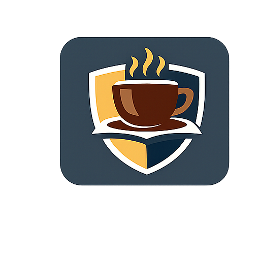

# 🍽️ University Non-Cafeteria Meal System



### 🚀 Digital Meal Ordering & QR Verification Platform for Universities


---

## 📌 Overview

The **University Non-Cafeteria Meal System** is a full-stack application that replaces traditional paper-based meal tickets with a **secure digital wallet and QR-based verification system**.

It enables students to order meals efficiently, while administrators manage menus, users, and transactions in real time.

---

## ✨ Features

### 👨‍🎓 Student Portal

* 🔐 Authentication (Laravel Sanctum)
* 💰 Wallet balance tracking
* 🍛 Browse menus
* 🛒 Cart-based ordering
* 📱 QR code generation per order
* 📜 Order history
* 🔔 Notifications

### 🛠️ Admin Portal

* 📊 Dashboard analytics
* 👥 Student management
* 🍽️ Menu management (CRUD)
* 📦 Order tracking
* 💳 Wallet top-up
* 🔍 QR scanner
* 📈 Reports & logs

---

## 🧰 Tech Stack

### Backend

* Laravel 12
* PHP 8.2
* Laravel Sanctum
* Spatie Permission
* MySQL
* Docker

### Frontend

* React 19 + TypeScript
* Vite
* React Router DOM
* TanStack Query
* Axios
* React Hook Form + Zod
* Tailwind CSS
* shadcn/ui + Radix UI

---

## 📡 API Overview

Base URL:

```
http://localhost:8000/api
```

### 🔓 Public

* GET /ping
* GET /health
* GET /user-health
* POST /register
* POST /login

### 🔐 Authenticated

* POST /logout
* GET /menus
* GET /menus/{id}
* GET /student-menu
* GET /menu-count
* GET /user/balance
* POST /orders
* GET /orders/{user_id}
* GET /orders/order-queues
* GET /download-qrcode/{orderId}
* GET /users/{user}
* PUT /users/{user}

### 🛡️ Admin

* POST /menus
* PUT /menus/{id}
* DELETE /menus/{menu}
* PUT /availability/{menu}
* GET /users
* DELETE /users/{user}
* PATCH /users/status/{user}
* POST /wallet/top-up/{user}
* PATCH /admin/scan
* GET /admin/orders
* GET /admin/system_log

---

## 🗄️ Database

Main entities:

* Users
* Wallets
* Menus
* Orders
* Transactions
* Logs

---

## 🔄 Order Flow

```
Browse Menu → Add to Cart → Place Order
       ↓
Wallet Deduction → QR Code Generated
       ↓
Admin Scans QR → Order Completed
```

---

## 🚀 Getting Started

### Backend

```
cd backend
composer install
cp .env.example .env
php artisan key:generate
php artisan migrate --seed
php artisan serve
```

---

### Frontend

```
cd client
npm install
cp .env.example .env
npm run dev
```

---

### Environment Variables

Backend `.env`:

```
DB_DATABASE=university_meal
DB_USERNAME=root
DB_PASSWORD=
```

Frontend `.env`:

```
VITE_API_URL=http://localhost:8000/api
```

---

## 🐳 Docker

```
docker build -t unimeal-backend .
docker run -p 8000:80 --env-file .env unimeal-backend
```

---

## 📁 Project Structure

```
backend/   → Laravel API
client/    → React Frontend
```

---

## 🔑 Roles

| Role    | Access         |
| ------- | -------------- |
| Admin   | Full system    |
| Student | Order & wallet |

---


GitHub: https://github.com/Melkias543
DEMO :https://non-caffe-contract-university.vercel.app/

---

## 👨‍💻 Author

Melkias Teshoma
Full-Stack Developer

---

## ⭐ Support

If you like this project, give it a ⭐ on GitHub!
